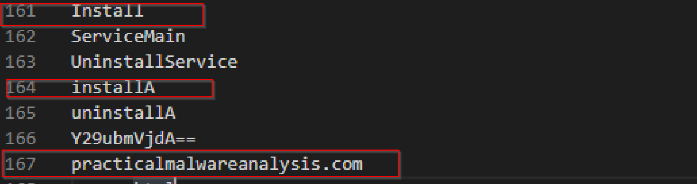
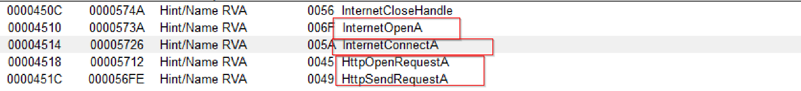

# Static analysis lab 03

## lab03-01

- hashes :
  - MD5 --> d537acb8f56a1ce206bc35cf8ff959c0
  - SHA256 --> eb84360ca4e33b8bb60df47ab5ce962501ef3420bc7aab90655fd507d2ffcedd
- uploading to virustotal : 
- important STRINGS : 
- IMPORTS :  why there is only one import is it packed?
- this malware is not packed why?  VirtualSize is nearly equal to SizeOfRawData
- what the malware do?
  - The malware is connecting to this domain [www.]practicalmalwareanalysis.[com]
  - tring to execute vmx32to64.exe
  - i think the output of step 2 is WinVMX32-

## lab03-02

- hashes :
  - MD5 : 84882c9d43e23d63b82004fae74ebb61
  - SHA256 : 5eced7367ed63354b4ed5c556e2363514293f614c2c2eb187273381b2ef5f0f9
- uploading to virustotal : 
- important STRINGS : 
- IMPORTS : 
- i can say that this malware is not packed
- what the malware do?
  - The malware is connecting to this domain www}.practicalmalwareanalysis.com
  - sending http request
  - instaling services
  - i think it is tring to download something

## lab03-03

- hashes :
  - MD5 : e2bf42217a67e46433da8b6f4507219e
  - SHA256 : ae8a1c7eb64c42ea2a04f97523ebf0844c27029eb040d910048b680f884b9dce
- uploading to virustotal : 
- important STRINGS :  Most of the strings was unreadable.
- IMPORTS : 
- what the malware do?
  - i can not decide now

## lab03-04

- hashes :
  - MD5 : b94af4a4d4af6eac81fc135abda1c40c
  - SHA256 : 6ac06dfa543dca43327d55a61d0aaed25f3c90cce791e0555e3e306d47107859
- uploading to virustotal : 
- important STRINGS : 
- IMPORTS : 
- what the malware do?
  - The malware is connecting to this domain www}.practicalmalwareanalysis.com
  - Download and write a file
  - i think it is important to use regshot in this malware

  # Basic dynamic analysis

## PMAT lab **Silly Putty**

### Q1

when i tried to execute putty.exe with out internet simulation it gives me this and there is a powershell screen appears.
%20%5BRunning%5D%20-%20Oracle%20VM%20VirtualBox.png)

when i tried to use my virtual machine ip i got this
%20%5BRunning%5D%20-%20Oracle%20VM%20VirtualBox.png)

### Q2

i will try to use procmon to confirm my expectations about the powershell screen
when u opene procces tree u will know that putty.exe opens powershell
%20%5BRunning%5D%20-%20Oracle%20VM%20VirtualBox.png)

in procorn u can see this process in its path u can see powershell.exe
%20%5BRunning%5D%20-%20Oracle%20VM%20VirtualBox.png)

when u see it is details u will find compression and 64 base that means we will need to decode it
 

after extracting it we will get our payload

### Q3

to get the DNS record i will use apateDNS
%20%5BRunning%5D%20-%20Oracle%20VM%20VirtualBox.png)

### Q4

The port number is 8443

%20%5BRunning%5D%20-%20Oracle%20VM%20VirtualBox.png)

### Q5

the callback protocol is TLSv1.2
%20%5BRunning%5D%20-%20Oracle%20VM%20VirtualBox.png)

### Q6

i wa not able to identify the DNS record, port, and protocol with host-based telemetry but u can get some info from tcpview

### Q7

